# 🛒 First School Project – Online Store

## 📘 Description

This was my **first large-scale project**, created at the age of 15 during my second year of high school  
for the *Web Application Programming* class.  
The entire project is built using **pure HTML, CSS, JavaScript, and PHP** – no external frameworks.  
It is structured according to the **MVC (Model-View-Controller)** design pattern.

---

## ⚠️ Note

> 🧠 **Keep in mind:**  
> This was my first serious programming project, so the code may not be optimal and the architecture might be unclear at times.

🔐 The project includes features like **account verification** and **password reset**, which require a valid email configuration using `sendmail.ini`.  
A sample configuration file is included in the repository, though its credentials may have expired.

---

## 🗂️ Project Structure

- `config/`
  - Database credentials
  - Predefined user IDs
- `css/`
  - Stylesheets
- `img/`
  - Common icons
  - Files uploaded by the admin
- `MVC/`
  - `controllers/`
    - `Controller.php` – Base controller class
    - Other specific controllers
  - `models/`
    - `databaseModels/` – Classes for database operations
    - `enumerated/` – Enumerated types
    - `validationHelpers/` – Input validation classes
    - `MailSender.php` – Sends emails (e.g. verification, password reset)
  - `views/`
    - `common/` – Shared layout components
    - Page-specific views
- `router/`
  - Routing logic and route definitions

---

## 💡 Key Features

- 🧾 User registration and login
- ✉️ Email verification
- 🔒 Password reset via email
- 🛍️ Basic shopping cart system
- 👨‍💼 Admin panel for product uploads

---

## 🛠️ Tech Stack

- **Frontend**: HTML5, CSS3, JavaScript (Vanilla)
- **Backend**: PHP (no framework)
- **Database**: MySQL
- **Architecture**: MVC
- **Other**: `sendmail` for email handling

---

## Images

### User interface

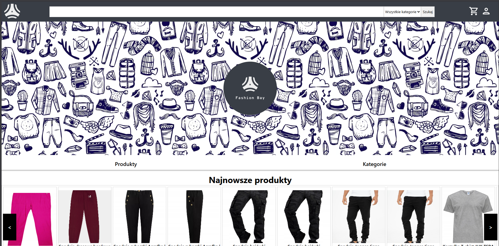
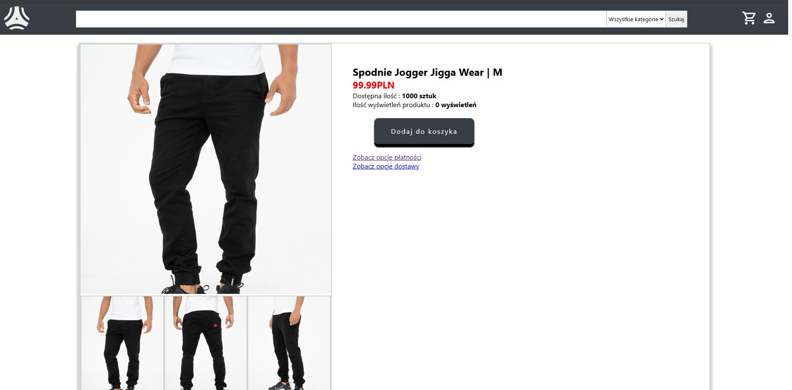
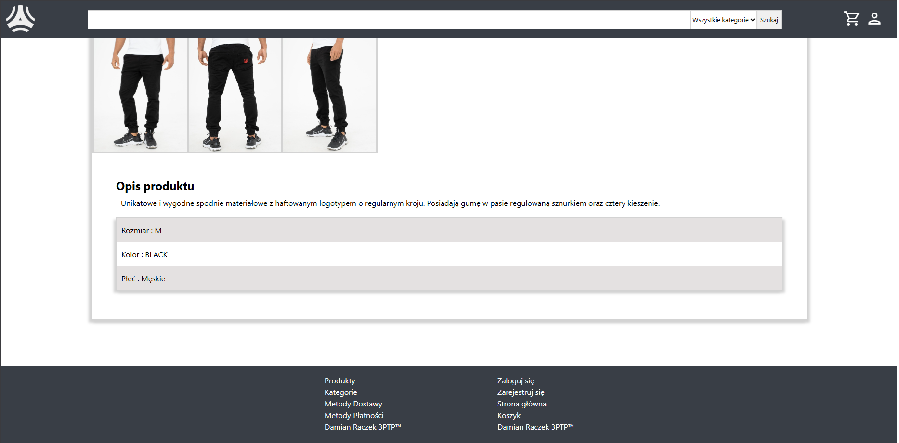
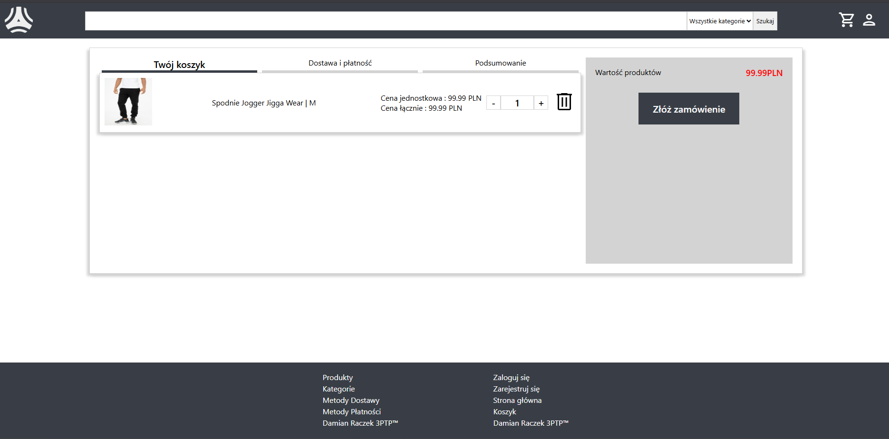
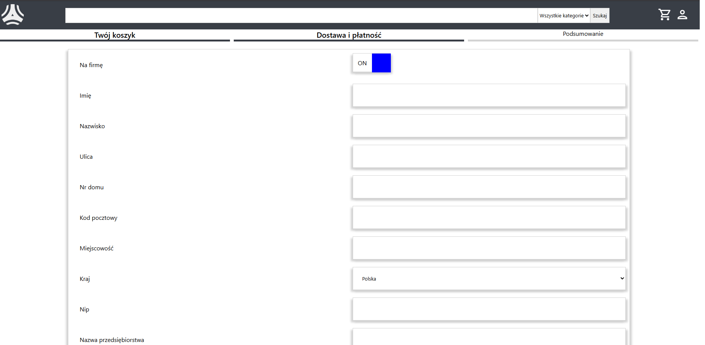
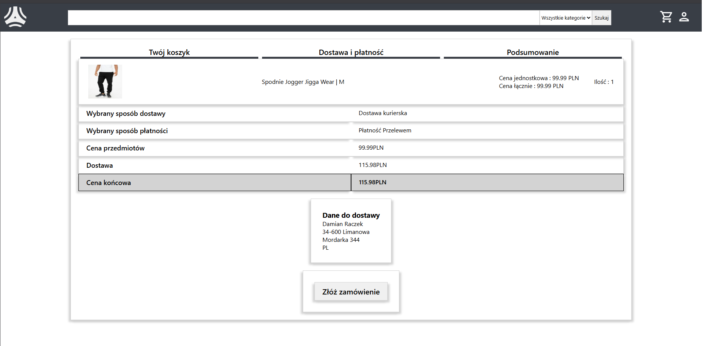
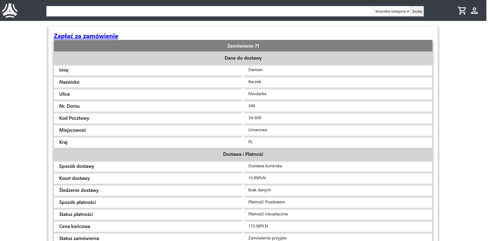
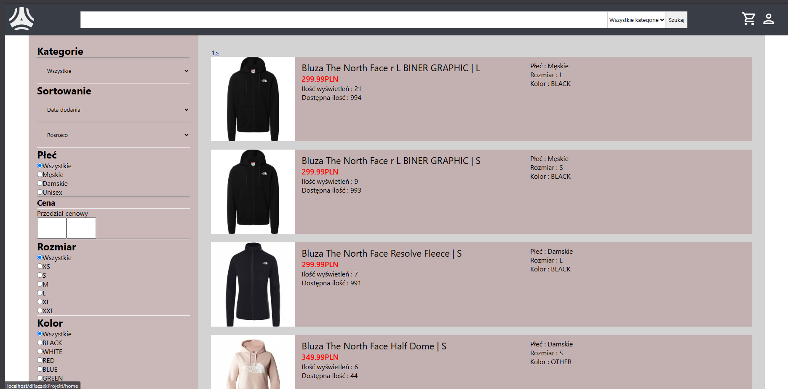

### Admin Panel

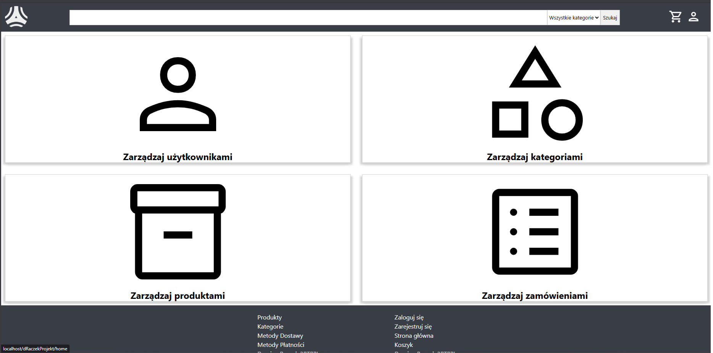
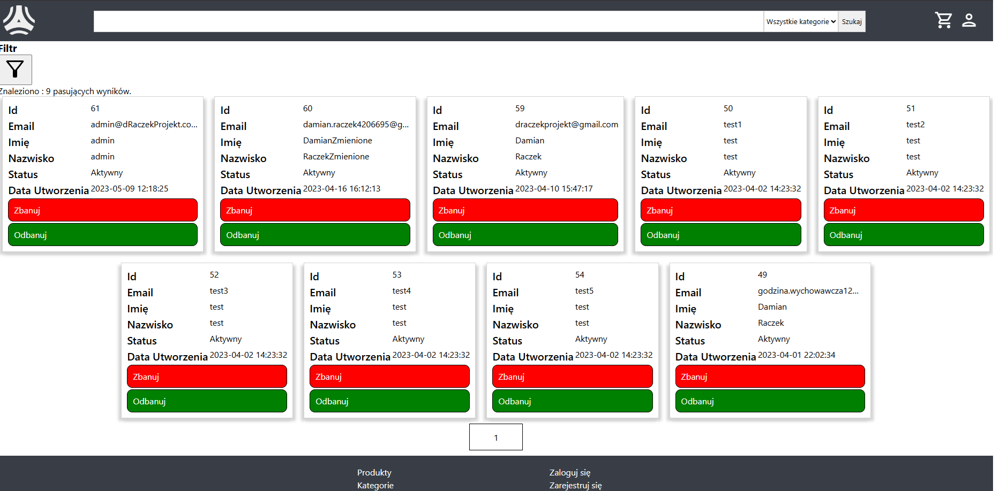
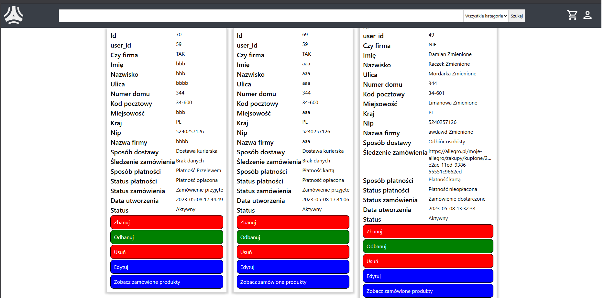
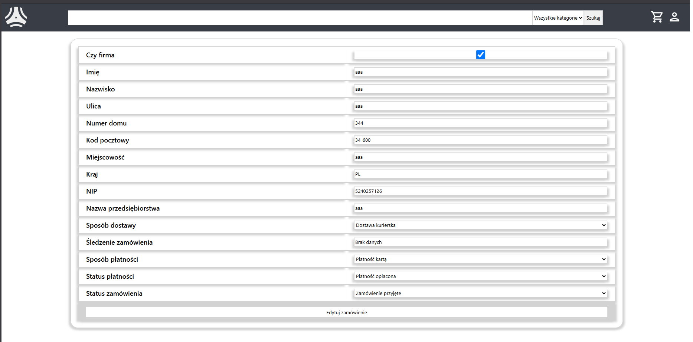
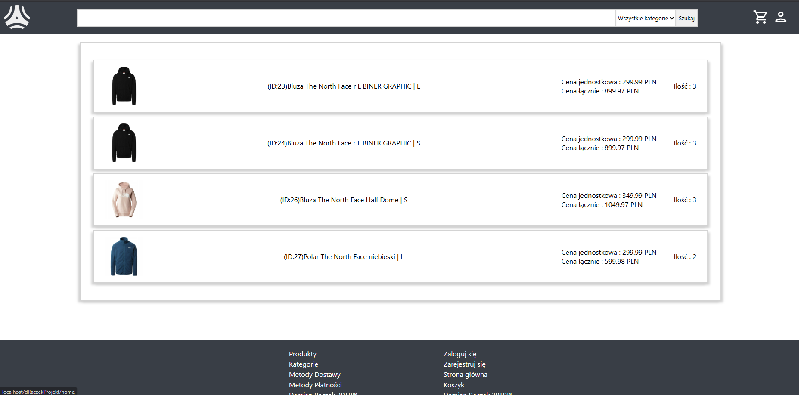
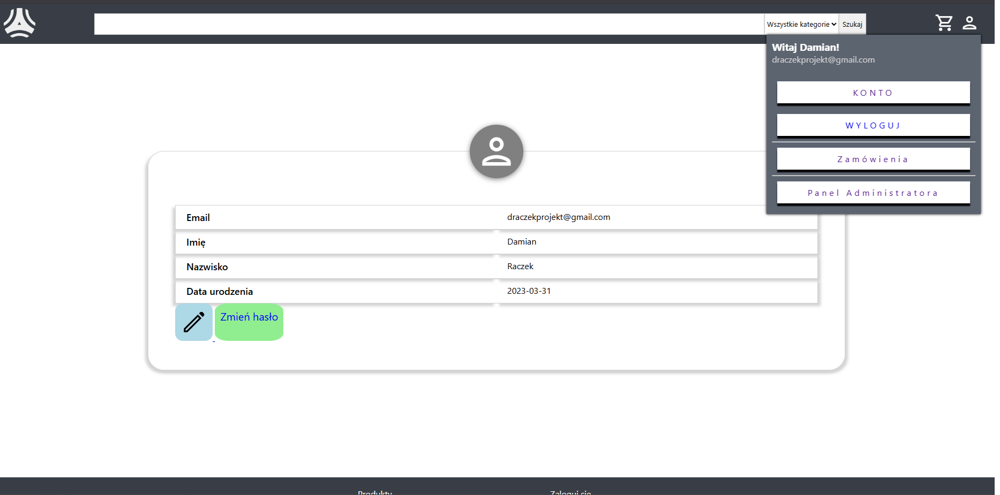

